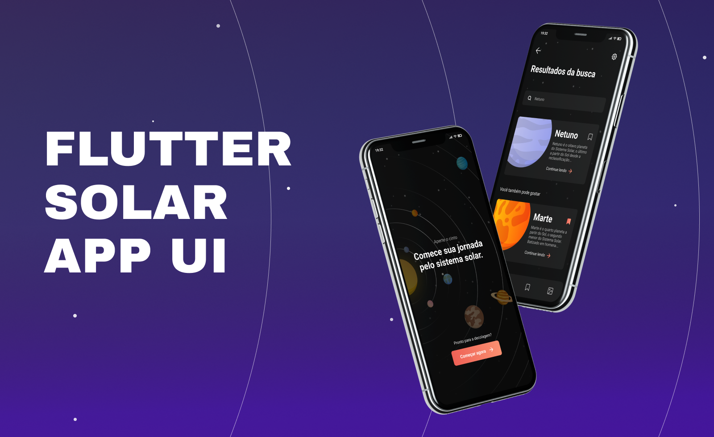
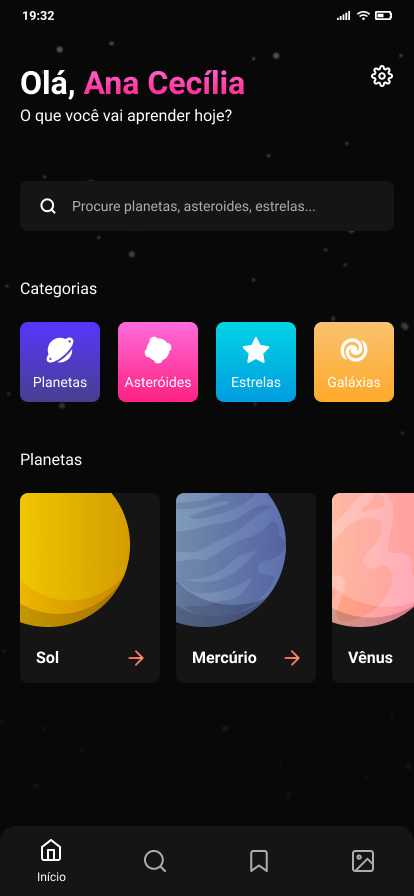
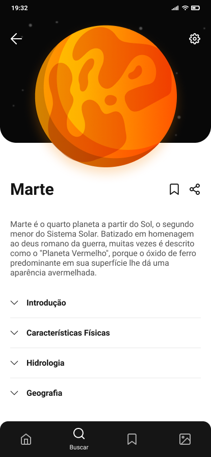
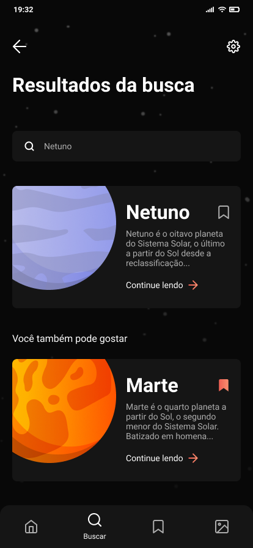
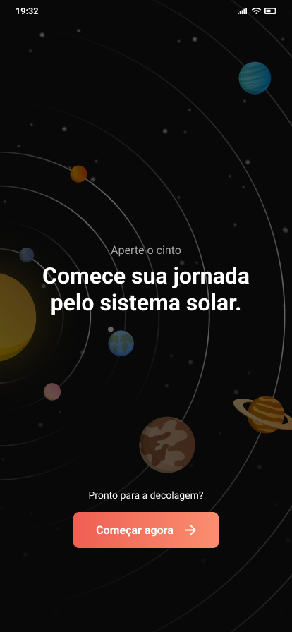

# Solar App - Flutter UI

- Screens

## Design

https://www.figma.com/community/file/871911270417939544

## Project Created & Maintained By

### Sabarinathan

Mobile and Backend Engineer (Android | Flutter | Rails)

